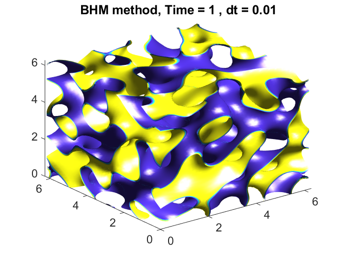

# 3D Phase-Field Simulations : 512^3 via GPU on a Laptop

# BCP-BHM-Blackwell-2026
First benchmark of 512³ 3D phase-field simulations  on consumer NVIDIA Blackwell GPUs via the BHM scheme  in MATLAB 2026a.  


# Why BHM?
Unlike SAV or Convex-Splitting methods, the Biharmonic-Modified (BHM) scheme avoids system enlargement and auxiliary variables. This linear, single-solve structure is essential for memory-dominated regimes, enabling 
 double-precision simulations on 24GB GPUs where other methods would typically trigger VRAM overflow.

Companion code for:
Orizaga et al. (2026), *Computers and Mathematics 
with Applications* (under review).

## Requirements
- MATLAB 2026a with Parallel Computing Toolbox
- NVIDIA GPU (RTX 5090 recommended)
- 24GB VRAM for N=512³ simulations

## Contents
- `CH3D_GPU_project_2025_BCP.m`: Main BCP simulation
- `visualization.m` : Isosurface and cross-section plots

## Usage
```matlab
% Run simulation
CH3D_GPU_project_2025_BCP(dt, M1, iter, tfinal, N)

% Example parameters
dt=0.01; M1=7.5; tfinal=100; N=256;
```
## Output
Running the codes: **CH3D_GPU_project_2026_BCP.m** followed by **visualization.m** will generate the following plot (\alpha near 0)



## Output
Running the codes: **CH3D_GPU_project_2026_Nested.m** followed by **visualization.m** will generate the following plot (\alpha near 20)


## Citation
If you use this code please cite:
Orizaga et al. (2026), Computers and Mathematics 
with Applications.

### Historical Note: 
The BHM methodology was originally developed to resolve the numerical challenges of variable-mobility Cahn-Hilliard equations. However, our research [Orizaga et al., 2024] demonstrated that the scheme provides superior memory efficiency even for constant-mobility systems. This work extends that benefit to the 3D Block Copolymer (BCP) model, leveraging the scheme's minimal memory footprint to break the barrier on consumer GPUs.
